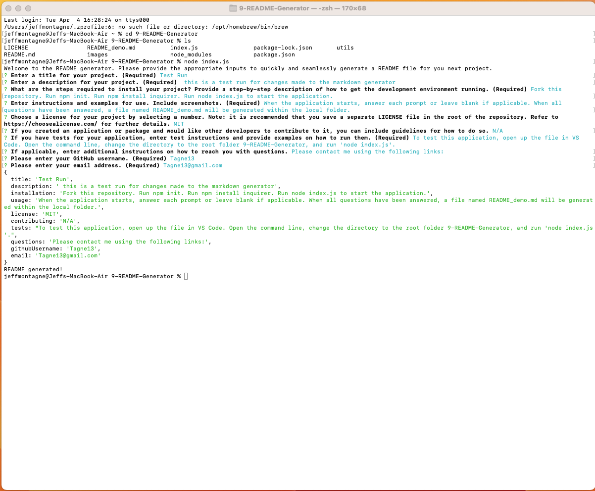

  # Professional README Generator

  
    []
    

  ## Table of Contents

  * [Description](#description)
  * [Installation](#installation)
  * [Usage](#usage)
  * 
    [MIT](https://choosealicense.com/licenses/mit)
    
  * [Contributing](#contributing)
  * [Tests](#tests)
  * [Questions](#questions)
  
  ## [Description](#table-of-contents)

  An application devloped using node.js that generates a professional README file based on user input.

  ## [Installation](#table-of-contents)

  Fork this repository. Run npm init. Run npm install inquirer. Run node index.js to start the application.

  ## [Usage](#table-of-contents)

  When the application starts, answer each prompt or leave blank if applicable. When all questions have been answered, a file named README_demo.md will be generated within the local folder.

  

  Video Walkthrough: [Click Here](https://drive.google.com/file/d/1mma42tS25WP35CsB5RDdd5XHMkB17MXl/view)
  
  ## [License](#table-of-contents)
    
  The application is covered under the following license:
    
    
  [MIT](https://choosealicense.com/licenses/mit)
    
    

  ## [Contributing](#table-of-contents)

  No contributions will be accepted at this time.

  ## [Tests](#table-of-contents)

  To test this application, open up the file in VS Code. Open the command line, change the directory to the root folder 9-README-Generator, and run 'node index.js'.

  ## [Questions](#table-of-contents)

  Please contact me using the following links:

  [GitHub](https://github.com/Tagne13)

  [Email: Tagne13@gmail.com](mailto:Tagne13@gmail.com)
